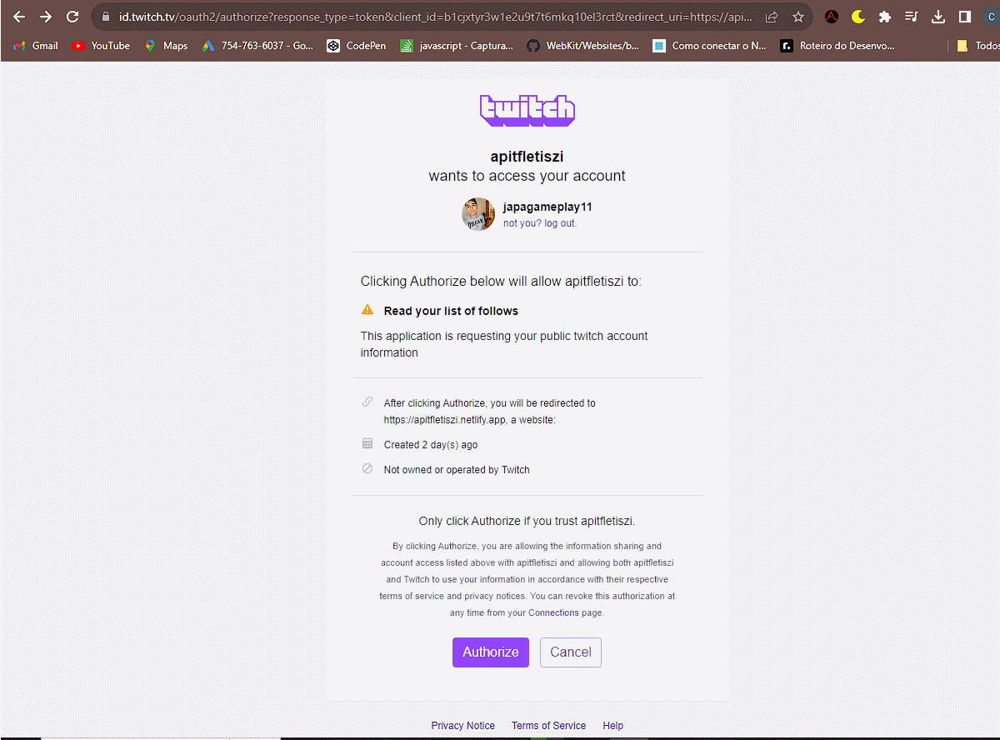
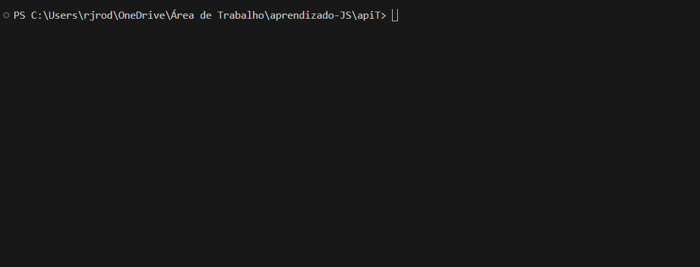

<h1 align="center" >
    
</h1>

# API_TWITCH 🤖
Meu repositório de criação, teste API TWITCH
<h1 align="center" >
    
</h1>


## 📖 Sobre

Em busca de aperfeiçoar meus conhecimentos, busquei por novos desafios que me permitisse ir alem dos conhecimentos que ja possuia e ultrapassar novas bareiras. E como uma grande paixão que sempre tive por games, a **TWICH** é uma plataforma que praticamente todos que gostam de games e da cultura geeke conhece... e foi pensando nisso que me desafiei a consumir **API** da **TWITCH**

No projeto **API_TWICTH** foi pensado para seja algo simples e util, trazendo informações sobre usuario, como canais que usuario segue se os mesmos estão online entre outros.

## 🔨 Ferramentas

- HTML
- CSS
- JavaScript
- Node.js 

## 💡 Oque apredi com esse projeto ?


NESTE PROJETO PRINCIPAIS CONHECIMENTOS ADQUIRIDOS:

- CONSULMO DE API EXTERNAS

- HTTP - (HEADER E BODY)

- ACESS TOKEN AUTHO 2.0

- IMPORTS / EXPORTS JS

- FETCH

- FUNCTIONS

- ARRAY MANIPULATION

- CREATE SERVER

- ROUTES (EXPRESS)

## Iniciando Projeto

❎ Oque é necessario par iniciarmos?
----
- Editor de texto de sua preferencia;
- Instalado Node.js em sua maquina;


Com tudo pronto podemos começar...

```bash
    #Clone repository
    $ git clone "https://github.com/FletisZi/API_TWITCH.git"
```
```bash
    #Install dependencies
    $ npm install
```
```bash
    #Start server
    $ npm start
```

---

Você pode notar que irá iniciar servidor local na porta "**:8080**". Você pode estar acessando seu navegador com http://localhost:8080/


<h1 align="center" >
    
</h1>
